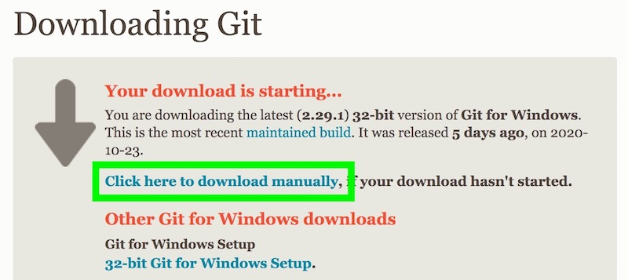
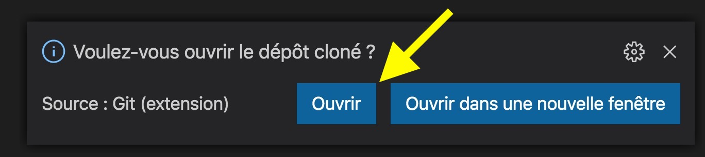

# Cours & Exercices

## Cours

Pour suivre le cours du module débutant, rendez-vous sur le [module débutant du site JavaScript de Zéro](https://www.javascriptdezero.com/module-debutant).

## Exercices

Voici les instructions à suivre pour cloner le dépôt GitHub du module débutant et faire les exercices depuis votre ordinateur dans Visual Studio Code.

Si vous avez un problème pendant l'installation, s'il vous plaît contactez-moi par email sur jeremy@javascriptdezero.com que je puisse vous aider ! Merci.

### Étape 1 : Installer Git

Si vous utilisez **Windows**, suivez ces instructions :

1. Cliquez sur [ce lien](https://git-scm.com/download/win), le téléchargement devrait débuter automatiquement mais si rien ne se passe, lisez l'étape 2.
2. Sur la page web qui vient de s'ouvrir, cliquez sur le lien **Click here to download manually** (voir ci-dessous où se trouve ce lien dans cette page):

   
3. Double-cliquez sur le fichier que vous venez de télécharger pour lancer l'installation.
4. Cliquez sur le bouton **Next** plusieurs fois puis sur le bouton **Install** et patientez un peu que ça s'installe.
5. **Décochez** la case **View Release Notes** et cliquez sur le bouton **Next** (on décoche cette case juste pour éviter d'ouvrir une page web inutile qui indique les nouveautés de cette version).
6. Une fois que c'est fait, **redémarrez votre ordinateur**.

---

Si vous utilisez **MacOS**, suivez ces instructions :

1. Cliquez sur [ce lien](https://git-scm.com/download/mac).
2. Cliquez sur le numéro de version dans la section Binary Installer :

   
3. Patientez un peu sur la page qui se charge, le téléchargement va débuter.
4. Une fois que le fichier est téléchargé, double-cliquez sur celui-ci.
5. Faites un clic droit sur le fichier package (qui se termine par ".pkg") et sélectionnez "Ouvrir" :

   
6. Une boîte de dialogue va apparaître, cliquez sur le bouton Ouvrir.
7. Cliquez sur le bouton Continuer, Installer, entrez votre mot de passe. Tout va s'installer.
8. Vous pouvez cliquer sur le bouton Fermer.

Tout est bien installé. Vous pouvez passer à la suite.

### Étape 2 : installer l'extension Live Server

L'extension **Live Server** permet de lancer un serveur Web connecté à VSCode.

Cela permet de mettre à jour instantanément le contenu de notre page Web dans le navigateur Chrome dès qu'on enregistre un fichier dans VSCode !

Sans cette extension il faudrait rafraîchir la page Web dans Chrome à chaque modification du code dans VSCode... quelle galère !

1. Ouvrez Visual Studio Code.
2. Allez dans l'onglet **Extensions** en cliquant sur l'icône depuis le panneau latéral de gauche. Vous pouvez également utiliser le raccourci clavier `⇧⌘X` sur Mac ou `Ctrl+Shift+X` sous Windows/Linux.

3. Tapez "live server" dans la barre de recherche, puis installez l'extension **Live Server** (par Ritwick Dey) en cliquant sur le bouton vert "Installer".

   
4. Redémarrez Visual Studio Code pour prendre en compte cette extension.

Cette extension permettra d'obtenir l'icône **Go Live** dans la barre bleue en bas de VSCode (voir les instructions ci-après).

   

### Étape 3 : cloner le dépôt du module débutant

Vous allez maintenant télécharger les exercices depuis VSCode.

1. Ouvrez la palette de commandes depuis le menu **Afficher > Palette de commandes** (raccourci clavier `⇧⌘P` sur Mac ou `Ctrl+Shift+P` sous Windows/Linux) puis tapez `git clone` et validez avec ENTRÉE. Si une erreur apparaît, lisez la suite !

   
2. Copier-collez le lien suivant et validez (attention à ne pas insérer d'espace en trop à la fin du lien !) : 
   
   https://github.com/javascriptdezero/module-debutant.git

   Voici une capture d'écran de ce que vous devez obtenir dans VSCode avant de taper sur la touche Entrée :

   
3. Visual Studio Code va vous demander dans quel répertoire vous voulez télécharger le dépôt GitHub de la formation. Sélectionnez le répertoire de votre choix (par exemple **Documents**), puis validez.
4. Une fois le téléchargement effectué vous aurez un nouveau répertoire **Documents/module-debutant**. Visual Studio Code va vous demander dans une popup en bas à droite si vous voulez ouvrir le dépôt cloné : cliquez sur le bouton **Ouvrir**.

   
5. Si vous ne voyez pas la popup de l'étape précédente (ou si elle disparaît), utilisez le menu **Fichier > Ouvrir** puis sélectionnez le répertoire **Documents/module-debutant**. Sélectionnez bien le répertoire **module-debutant** et pas **Documents** avant de cliquer sur `Ouvrir`.

### Étape 4 : faire un exercice

**Note importante** : le fonctionnement des exercices est différent des vidéos. Vous n'aurez pas besoin d'exécuter votre code avec CTRL+F5 (ou le menu "Exécuter sans déboguer"). Pas besoin d'utiliser la console de débogage dans VSCode non plus.

En effet, votre code sera vérifié automatiquement dès que vous enregistrez le fichier **exercices.js** dans VSCode ! Le résultat sera affiché directement dans Chrome !

Voici comment faire un exercice : 

1. Ouvrez VSCode puis ouvrez le **dossier module-debutant**.
2. Assurez-vous de voir la liste de fichiers en cliquant sur l'icône Fichiers (étape 1 dans l'image). Cliquez à nouveau dessus si la liste de fichiers disparaît.

   
3. Cliquez sur le répertoire **cours** dans la liste de fichiers puis sur le cours de votre choix par exemple **05 - Les chaines de caractères**.
4. Double-cliquez sur le fichier **exercices.html** (ou un des fichiers se terminant par **.html**) comme indiqué à l'étape 2 sur l'image.
5. Lancez le serveur Web (fourni par l'extension **Live Server**) en cliquant sur **Go Live** tout en bas dans la barre d'état bleue (étape 3 dans l'image ci-dessus). Si le bouton **Go Live** n'apparaît pas en bas, faites un clic droit sur le fichier **exercices.html** et cliquez sur **Open with Live Server**.

   > **Note importante** : si vous utilisez le bouton Go Live en bas à droite, assurez-vous toujours que le fichier actuellement ouvert soit bien un fichier se terminant par **.html** sinon ça ne fonctionnera pas.

   > **Redémarrer le serveur** : une fois cliqué le bouton Go Live se transforme en bouton ci-dessous pour indiquer qu'un serveur fonctionne sur le port 5500 :

   

   > En cliquant sur ce bouton, vous arrêterez le serveur web et pourrez le relancer si un plantage survient dans votre page (boucle infinie par exemple).
6. Le navigateur Chrome devrait se lancer tout seul et vous afficher les exercices (descendez un peu dans la page pour voir les premiers énoncés):

    
7. Pour répondre à un énoncé, double-cliquez sur le fichier **exercices.js** (ou le fichier se terminant par **.js**) pour commencer à coder vos réponses (étape 2 de l'image) !

    
8. Dès que vous enregistrez vos modifications dans le fichier **exercices.js** le navigateur se mettra à jour et vous dira si vous avez réussi ou pas les exercices. Bon courage !

    
9. Pour faire les exercices d'une autre leçon, il suffit de recommencer à l'étape 7 en sélectionnant la leçon de votre choix.

Pour toute question, merci de me contacter par email sur jeremy@javascriptdezero.com.

### Bonnes pratiques

Si vous avez un écran assez grand, mettez le code à gauche et Chrome à droite, comme ça vous codez à gauche et vous avez le résultat tout de suite à droite :

Voici quelques conseils pour résoudre les exercices :

- Prenez votre temps, ce n'est pas chronométré !
- Modifiez le nom des variables si ça vous aide à mieux comprendre la logique du programme
- Formatez le programme pour séparer les différentes phases de celui-ci, quelques lignes vides et espaces bien placés font parfois des miracles !
- Résolvez les exercices dans l'ordre. La difficulté est croissante et certains exercices utilisent le précédent comme base de solution
- Si vous bloquez sur un exercice, prenez une pause comme je l'explique dans la section "Sortir d'une situation bloquante" de [la leçon "Comment apprendre à programmer"](https://www.javascriptdezero.com/courses/module-debutant/87615-introduction/249456-comment-apprendre-a-programmer).

Bon courage !