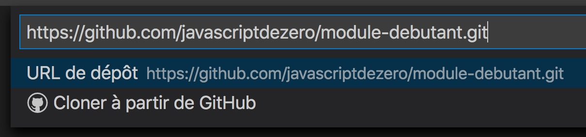
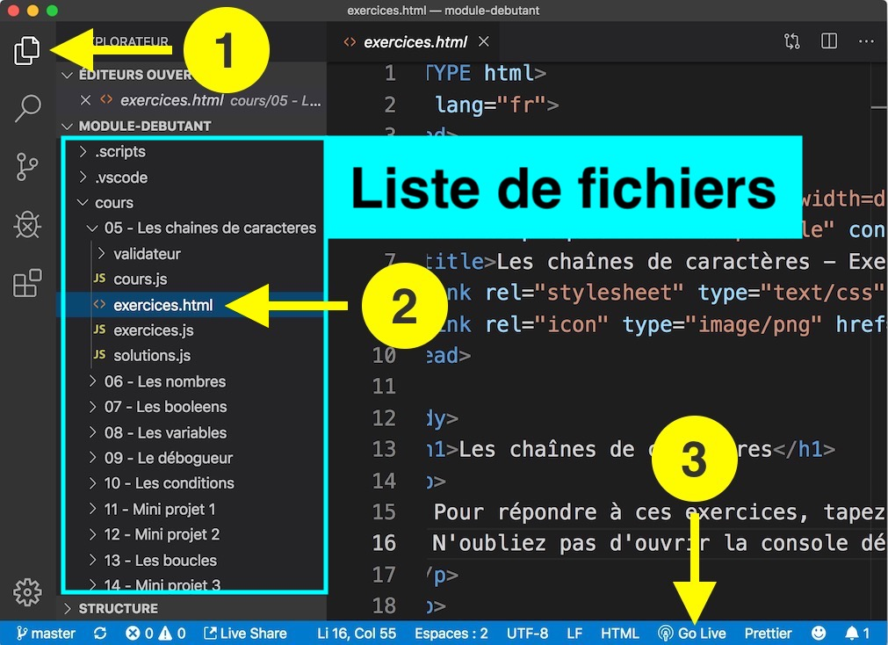

# Cours

## Exercices

Pour faire les exercices [suivez ces instructions](#En-savoir-plus-sur-les-exercices).

> Les noms de fichiers et répertoires sont sans accents pour éviter des problèmes dans Visual Studio Code.

## Vidéos

Pour lire l'intégralité de ces vidéos dans l'ordre, utilisez la [playlist YouTube du module débutant](https://www.youtube.com/watch?v=JeqZNiAhnlE&list=PLyj4q0fkISxAPXLZqNq5gCKcCVLBqL9nB).

Utilisez la fonction recherche du navigateur pour trouver ce qui vous intéresse rapidement. Cliquez sur la durée du sommaire de la vidéo pour accéder directement à la partie qui vous intéresse.

1. [Présentation du module débutant [M0L00]](https://www.youtube.com/watch?v=JeqZNiAhnlE)

   - [00:15](https://www.youtube.com/watch?v=JeqZNiAhnlE&t=15s) À qui s'adresse ce module ?
   - [00:30](https://www.youtube.com/watch?v=JeqZNiAhnlE&t=30s) Ce que vous allez apprendre
   - [00:50](https://www.youtube.com/watch?v=JeqZNiAhnlE&t=50s) Objectifs du module
   - [01:30](https://www.youtube.com/watch?v=JeqZNiAhnlE&t=90s) Format des leçons
   - [02:00](https://www.youtube.com/watch?v=JeqZNiAhnlE&t=120s) Pourquoi une formation en Français ?
   - [02:50](https://www.youtube.com/watch?v=JeqZNiAhnlE&t=170s) Sources d'informations techniques (livres)
   - [03:12](https://www.youtube.com/watch?v=JeqZNiAhnlE&t=192s) Culture du développeur
   - [03:36](https://www.youtube.com/watch?v=JeqZNiAhnlE&t=216s) Conseils aux débutants
   - [04:35](https://www.youtube.com/watch?v=JeqZNiAhnlE&t=275s) Exercices sur GitHub
   - [04:58](https://www.youtube.com/watch?v=JeqZNiAhnlE&t=298s) Questions et FAQ

2. [Comment installer Visual Studio Code et NodeJS (+2 alternatives) [M0L01]](https://www.youtube.com/watch?v=ig9EOn17vFM)

   - [00:28](https://www.youtube.com/watch?v=ig9EOn17vFM&t=28s) Téléchargement de Chrome
   - [01:08](https://www.youtube.com/watch?v=ig9EOn17vFM&t=68s) Installation de Chrome
   - [01:35](https://www.youtube.com/watch?v=ig9EOn17vFM&t=95s) Moteur JavaScript V8
   - [01:50](https://www.youtube.com/watch?v=ig9EOn17vFM&t=110s) La console JavaScript
   - [02:10](https://www.youtube.com/watch?v=ig9EOn17vFM&t=130s) Exécution de code JavaScript dans la console Chrome
   - [02:40](https://www.youtube.com/watch?v=ig9EOn17vFM&t=160s) Limitations de la console
   - [03:00](https://www.youtube.com/watch?v=ig9EOn17vFM&t=180s) Utiliser les snippets pour coder facilement
   - [04:30](https://www.youtube.com/watch?v=ig9EOn17vFM&t=270s) Installation de NodeJS
   - [04:35](https://www.youtube.com/watch?v=ig9EOn17vFM&t=275s) Astuce pour les Français pour traduire les pages web
   - [05:40](https://www.youtube.com/watch?v=ig9EOn17vFM&t=340s) Téléchargement de NodeJS et Visual Studio Code
   - [05:54](https://www.youtube.com/watch?v=ig9EOn17vFM&t=354s) Qu'est-ce que NodeJS ?
   - [06:10](https://www.youtube.com/watch?v=ig9EOn17vFM&t=370s) Installation de NodeJS
   - [06:27](https://www.youtube.com/watch?v=ig9EOn17vFM&t=387s) Démonstration NodeJS via le terminal
   - [07:50](https://www.youtube.com/watch?v=ig9EOn17vFM&t=470s) Installation de Visual Studio Code
   - [08:20](https://www.youtube.com/watch?v=ig9EOn17vFM&t=500s) Configuration du zoom de Visual Studio Code
   - [08:45](https://www.youtube.com/watch?v=ig9EOn17vFM&t=525s) Installation de l'extension pack Français pour VSCode
   - [10:35](https://www.youtube.com/watch?v=ig9EOn17vFM&t=635s) Comment sauvegarder un fichier sous VSCode
   - [11:20](https://www.youtube.com/watch?v=ig9EOn17vFM&t=680s) Raccourci @sort:installs sous VSCode
   - [11:45](https://www.youtube.com/watch?v=ig9EOn17vFM&t=705s) Installation de Bracket Pair Colorizer et Live Share
   - [12:47](https://www.youtube.com/watch?v=ig9EOn17vFM&t=767s) Création d'un projet JavaScript de test dans VSCode
   - [13:50](https://www.youtube.com/watch?v=ig9EOn17vFM&t=830s) Exécution du code JavaScript (sans débogueur)
   - [14:25](https://www.youtube.com/watch?v=ig9EOn17vFM&t=865s) Comment déboguer du code JavaScript
   - [15:30](https://www.youtube.com/watch?v=ig9EOn17vFM&t=930s) Configuration de Team Chat pour Slack
   - [16:18](https://www.youtube.com/watch?v=ig9EOn17vFM&t=978s) Alternatives à VSCode en ligne
   - [16:48](https://www.youtube.com/watch?v=ig9EOn17vFM&t=1008s) Présentation de Thimble de Mozilla
   - [18:00](https://www.youtube.com/watch?v=ig9EOn17vFM&t=1080s) Déboguer avec Thimble
   - [19:28](https://www.youtube.com/watch?v=ig9EOn17vFM&t=1168s) Présentation de JSFiddle
   - [20:45](https://www.youtube.com/watch?v=ig9EOn17vFM&t=1245s) Déboguer avec JSFiddle
   - [21:00](https://www.youtube.com/watch?v=ig9EOn17vFM&t=1260s) Sauvegarder son code en ligne via JSFiddle
   - [21:55](https://www.youtube.com/watch?v=ig9EOn17vFM&t=1315s) Des questions ? N'oubliez pas de cliquer sur J'aime ! MERCI !

3. [Votre premier programme JavaScript (avec Visual Studio Code) [M0L02]](https://www.youtube.com/watch?v=NRmlXat3U_o)

   - [00:24](https://www.youtube.com/watch?v=NRmlXat3U_o&t=24s) Création d'un nouveau projet sous Visual Studio Code
   - [01:15](https://www.youtube.com/watch?v=NRmlXat3U_o&t=75s) Création d'un nouveau fichier
   - [01:52](https://www.youtube.com/watch?v=NRmlXat3U_o&t=112s) Sauvegarder un fichier sous Visual Studio Code
   - [02:20](https://www.youtube.com/watch?v=NRmlXat3U_o&t=140s) Extension de fichier .js (code JavaScript)
   - [02:33](https://www.youtube.com/watch?v=NRmlXat3U_o&t=153s) Coloration syntaxique du langage JavaScript
   - [02:55](https://www.youtube.com/watch?v=NRmlXat3U_o&t=175s) Qu'est-ce qu'une instruction ?
   - [03:08](https://www.youtube.com/watch?v=NRmlXat3U_o&t=188s) Configuration de Visual Studio Code
   - [03:30](https://www.youtube.com/watch?v=NRmlXat3U_o&t=210s) Activer la sauvegarde automatique dans Visual Studio Code
   - [04:10](https://www.youtube.com/watch?v=NRmlXat3U_o&t=250s) Démonstration sauvegarde automatique
   - [04:40](https://www.youtube.com/watch?v=NRmlXat3U_o&t=280s) Arrêter le clignotement du curseur
   - [05:07](https://www.youtube.com/watch?v=NRmlXat3U_o&t=307s) Lecture du code par l'interpréteur JavaScript
   - [05:28](https://www.youtube.com/watch?v=NRmlXat3U_o&t=328s) Exécution du programme
   - [05:34](https://www.youtube.com/watch?v=NRmlXat3U_o&t=334s) Afficher la console de débogage
   - [06:10](https://www.youtube.com/watch?v=NRmlXat3U_o&t=370s) Modification du programme pour afficher une sortie différente
   - [06:38](https://www.youtube.com/watch?v=NRmlXat3U_o&t=398s) Raccourci clavier pour déplacer une ligne de code ou un bloc de code
   - [07:45](https://www.youtube.com/watch?v=NRmlXat3U_o&t=465s) Deux instructions sur la même ligne
   - [08:15](https://www.youtube.com/watch?v=NRmlXat3U_o&t=495s) Les lignes vides sont ignorées
   - [08:40](https://www.youtube.com/watch?v=NRmlXat3U_o&t=520s) Les commentaires en JavaScript
   - [08:55](https://www.youtube.com/watch?v=NRmlXat3U_o&t=535s) Ecrire un commentaire sur une ligne avec le double slash
   - [09:35](https://www.youtube.com/watch?v=NRmlXat3U_o&t=575s) Raccourci clavier pour commenter une ligne sous Visual Studio Code
   - [09:55](https://www.youtube.com/watch?v=NRmlXat3U_o&t=595s) Commentaires sur plusieurs lignes avec /_ et _/
   - [10:14](https://www.youtube.com/watch?v=NRmlXat3U_o&t=614s) Utiliser les commentaires pour désactiver/déboguer du code
   - [11:10](https://www.youtube.com/watch?v=NRmlXat3U_o&t=670s) La guerre des point-virgules (voir la FAQ sur GitHub)
   - [12:47](https://www.youtube.com/watch?v=NRmlXat3U_o&t=767s) Dépôt GitHub de la formation, comment bien l'utiliser ?
   - [14:00](https://www.youtube.com/watch?v=NRmlXat3U_o&t=840s) Des questions ? Cliquez sur J'aime, merci :) !

4. [Comment utiliser la documentation JavaScript ? (MDN et DevDocs.io) [M0L03]](https://www.youtube.com/watch?v=jnbiNr9b_lk)

   - [00:14](https://www.youtube.com/watch?v=jnbiNr9b_lk&t=14s) Pourquoi j'enseigne l'utilisation de la doc ?
   - [00:36](https://www.youtube.com/watch?v=jnbiNr9b_lk&t=36s) L'erreur FATALE des cours de programmation
   - [00:55](https://www.youtube.com/watch?v=jnbiNr9b_lk&t=55s) Dépendance aux cours
   - [01:02](https://www.youtube.com/watch?v=jnbiNr9b_lk&t=62s) Vous ne savez pas déboguer par vous-même
   - [01:26](https://www.youtube.com/watch?v=jnbiNr9b_lk&t=86s) Les sources de documentation
   - [01:41](https://www.youtube.com/watch?v=jnbiNr9b_lk&t=101s) Le MDN (Mozilla Developer Network)
   - [01:55](https://www.youtube.com/watch?v=jnbiNr9b_lk&t=115s) ASTUCE: lien mdn.io
   - [02:13](https://www.youtube.com/watch?v=jnbiNr9b_lk&t=133s) Qu'est-ce que le MDN ?
   - [02:34](https://www.youtube.com/watch?v=jnbiNr9b_lk&t=154s) Mettre le MDN en Français
   - [02:48](https://www.youtube.com/watch?v=jnbiNr9b_lk&t=168s) Les pages de référence sont en Anglais
   - [03:23](https://www.youtube.com/watch?v=jnbiNr9b_lk&t=203s) Différence de contenu entre Anglais / Français avec la page reduce()
   - [03:26](https://www.youtube.com/watch?v=jnbiNr9b_lk&t=206s) Changer la langue de la documentation sur le MDN
   - [03:43](https://www.youtube.com/watch?v=jnbiNr9b_lk&t=223s) Exemple de différences dans les pages de doc
   - [04:18](https://www.youtube.com/watch?v=jnbiNr9b_lk&t=258s) Les inconvénients du MDN
   - [04:27](https://www.youtube.com/watch?v=jnbiNr9b_lk&t=267s) DevDocs.io
   - [05:00](https://www.youtube.com/watch?v=jnbiNr9b_lk&t=300s) Cours rapide sur DevDocs
   - [05:19](https://www.youtube.com/watch?v=jnbiNr9b_lk&t=319s) Activer les données hors ligne
   - [05:29](https://www.youtube.com/watch?v=jnbiNr9b_lk&t=329s) Effectuer une recherche sur DevDocs
   - [05:49](https://www.youtube.com/watch?v=jnbiNr9b_lk&t=349s) Démonstration DevDocs hors ligne (sans accès internet)
   - [06:25](https://www.youtube.com/watch?v=jnbiNr9b_lk&t=385s) Utiliser la barre d'adresse Google Chrome comme moteur de recherche
   - [06:47](https://www.youtube.com/watch?v=jnbiNr9b_lk&t=407s) Démonstration avec DevDocs.io
   - [07:00](https://www.youtube.com/watch?v=jnbiNr9b_lk&t=420s) La spécification ECMAScript
   - [07:52](https://www.youtube.com/watch?v=jnbiNr9b_lk&t=472s) ASTUCE DE PRO : créer des raccourcis pour chercher directement dans les docs JS depuis la barre d'adresse Chrome
   - [08:30](https://www.youtube.com/watch?v=jnbiNr9b_lk&t=510s) Configuration pour le raccourci vers DevDocs.io
   - [08:47](https://www.youtube.com/watch?v=jnbiNr9b_lk&t=527s) Configuration pour le raccourci vers le MDN en français
   - [09:00](https://www.youtube.com/watch?v=jnbiNr9b_lk&t=540s) Démonstration 'dd reduce' renvoie vers la page reduce() de DevDocs
   - [09:11](https://www.youtube.com/watch?v=jnbiNr9b_lk&t=551s) Démonstration 'mdn reduce' renvoie vers la page reduce() de MDN (fr)
   - [09:23](https://www.youtube.com/watch?v=jnbiNr9b_lk&t=563s) Des questions ? N'oubliez pas de cliquer sur J'aime, MERCI !

5. [Comment lire la documentation JavaScript du MDN ? [M0L04]](https://www.youtube.com/watch?v=J7IFmQhKpd0)

   - [00:12](https://www.youtube.com/watch?v=J7IFmQhKpd0&t=12s) Rappel sur console.log
   - [00:31](https://www.youtube.com/watch?v=J7IFmQhKpd0&t=31s) Recherche de console.log sur le MDN
   - [00:47](https://www.youtube.com/watch?v=J7IFmQhKpd0&t=47s) Mettre la page de documentation en Français
   - [00:57](https://www.youtube.com/watch?v=J7IFmQhKpd0&t=57s) Les différentes sections de la documentation
   - [01:10](https://www.youtube.com/watch?v=J7IFmQhKpd0&t=70s) Syntaxe (explications)
   - [01:48](https://www.youtube.com/watch?v=J7IFmQhKpd0&t=108s) Paramètres
   - [02:23](https://www.youtube.com/watch?v=J7IFmQhKpd0&t=143s) Si vous ne comprenez pas tout, c'est normal !
   - [02:40](https://www.youtube.com/watch?v=J7IFmQhKpd0&t=160s) Spécification
   - [02:50](https://www.youtube.com/watch?v=J7IFmQhKpd0&t=170s) Compatibilité des navigateurs
   - [03:11](https://www.youtube.com/watch?v=J7IFmQhKpd0&t=191s) Définition de "supporter"
   - [03:23](https://www.youtube.com/watch?v=J7IFmQhKpd0&t=203s) Informations complémentaires
   - [03:35](https://www.youtube.com/watch?v=J7IFmQhKpd0&t=215s) Voir aussi
   - [03:50](https://www.youtube.com/watch?v=J7IFmQhKpd0&t=230s) Méthode reduce (recherche sur le MDN)
   - [04:05](https://www.youtube.com/watch?v=J7IFmQhKpd0&t=245s) Bloc de démonstration JavaScript Array.reduce
   - [04:50](https://www.youtube.com/watch?v=J7IFmQhKpd0&t=290s) Utilité du bloc JavaScript démo dans la doc
   - [05:00](https://www.youtube.com/watch?v=J7IFmQhKpd0&t=300s) Syntaxe de reduce
   - [05:10](https://www.youtube.com/watch?v=J7IFmQhKpd0&t=310s) Description détaillée et exemples
   - [05:28](https://www.youtube.com/watch?v=J7IFmQhKpd0&t=328s) Exemples concrets supplémentaires
   - [06:17](https://www.youtube.com/watch?v=J7IFmQhKpd0&t=377s) Polyfill (prothèse d'émulation)
   - [06:28](https://www.youtube.com/watch?v=J7IFmQhKpd0&t=388s) Spécification
   - [06:48](https://www.youtube.com/watch?v=J7IFmQhKpd0&t=408s) Informations générales sur un sujet comme Console
   - [07:07](https://www.youtube.com/watch?v=J7IFmQhKpd0&t=427s) Sujet associé : console
   - [07:16](https://www.youtube.com/watch?v=J7IFmQhKpd0&t=436s) Liste des méthodes de console
   - [07:30](https://www.youtube.com/watch?v=J7IFmQhKpd0&t=450s) Méthode clear()
   - [07:41](https://www.youtube.com/watch?v=J7IFmQhKpd0&t=461s) Accès à la doc globale de console
   - [08:28](https://www.youtube.com/watch?v=J7IFmQhKpd0&t=508s) Une formation qui rend indépendant
   - [09:03](https://www.youtube.com/watch?v=J7IFmQhKpd0&t=543s) Des questions ?
   - [09:12](https://www.youtube.com/watch?v=J7IFmQhKpd0&t=552s) Merci de cliquer sur J'aime et abonnez-vous :)

6. [Les chaînes de caractères (Strings) en JavaScript [M0L05]](https://www.youtube.com/watch?v=YPY4Y7inlIc)

    - [00:12](https://www.youtube.com/watch?v=YPY4Y7inlIc&t=12s) But d'un programme informatique
    - [00:24](https://www.youtube.com/watch?v=YPY4Y7inlIc&t=24s) Les chaînes de caractères
    - [00:35](https://www.youtube.com/watch?v=YPY4Y7inlIc&t=35s) Exemple de chaîne de caractères
    - [01:00](https://www.youtube.com/watch?v=YPY4Y7inlIc&t=60s) Qu'est-ce qu'une chaîne de caractères ? Un caractère ?
    - [01:15](https://www.youtube.com/watch?v=YPY4Y7inlIc&t=75s) Exemple de caractères
    - [01:20](https://www.youtube.com/watch?v=YPY4Y7inlIc&t=80s) Les Emojis sont aussi des caractères
    - [01:32](https://www.youtube.com/watch?v=YPY4Y7inlIc&t=92s) Pas de nouvelle ligne dans les chaînes de caractères !
    - [01:45](https://www.youtube.com/watch?v=YPY4Y7inlIc&t=105s) Erreur littéral de chaîne inachevée
    - [02:05](https://www.youtube.com/watch?v=YPY4Y7inlIc&t=125s) Le caractère nouvelle ligne est invisible
    - [02:35](https://www.youtube.com/watch?v=YPY4Y7inlIc&t=155s) Comment créer une chaîne de caractères ?
    - [02:40](https://www.youtube.com/watch?v=YPY4Y7inlIc&t=160s) Avec les doubles guillemets
    - [02:48](https://www.youtube.com/watch?v=YPY4Y7inlIc&t=168s) Avec les guillemets simples (apostrophe)
    - [03:00](https://www.youtube.com/watch?v=YPY4Y7inlIc&t=180s) Quand utiliser l'une ou l'autre façon ?
    - [03:15](https://www.youtube.com/watch?v=YPY4Y7inlIc&t=195s) Quand utiliser les guillemets doubles
    - [04:24](https://www.youtube.com/watch?v=YPY4Y7inlIc&t=264s) Quand utiliser les guillemets simples
    - [04:55](https://www.youtube.com/watch?v=YPY4Y7inlIc&t=295s) Echapper un caractère avec anti-slash \
    - [06:45](https://www.youtube.com/watch?v=YPY4Y7inlIc&t=405s) Afficher plusieurs lignes avec la séquence d'échappement \n
    - [07:49](https://www.youtube.com/watch?v=YPY4Y7inlIc&t=469s) La concaténation de chaînes de caractères
    - [09:25](https://www.youtube.com/watch?v=YPY4Y7inlIc&t=565s) A quoi sert la concaténation ?
    - [09:38](https://www.youtube.com/watch?v=YPY4Y7inlIc&t=578s) Nouveauté EcmaScript 6 : modèles de libellés (template strings, literals)
    - [10:25](https://www.youtube.com/watch?v=YPY4Y7inlIc&t=625s) Avantages des modèles de libellés
    - [11:20](https://www.youtube.com/watch?v=YPY4Y7inlIc&t=680s) Inconvénient des modèles de libellés
    - [11:28](https://www.youtube.com/watch?v=YPY4Y7inlIc&t=688s) Bonne pratique : ne cassez pas les longues chaînes de caractères !
    - [12:36](https://www.youtube.com/watch?v=YPY4Y7inlIc&t=756s) Option pour réduire les longues chaînes de caractères dans Visual Studio Code
    - [13:10](https://www.youtube.com/watch?v=YPY4Y7inlIc&t=790s) Bonne pratique : utilisez les anti-slashs avec parcimonie !
    - [14:00](https://www.youtube.com/watch?v=YPY4Y7inlIc&t=840s) Bonne pratique : préférez les backticks
    - [14:11](https://www.youtube.com/watch?v=YPY4Y7inlIc&t=851s) Astuces Visual Studio Code
    - [14:25](https://www.youtube.com/watch?v=YPY4Y7inlIc&t=865s) Entourez votre sélection facilement avec Visual Studio Code
    - [15:04](https://www.youtube.com/watch?v=YPY4Y7inlIc&t=904s) Sélection rapide avec le clavier Cmd+Ctrl+Shift+→
    - [15:30](https://www.youtube.com/watch?v=YPY4Y7inlIc&t=930s) Exercices sur GitHub (à vous de coder !)
    - [15:44](https://www.youtube.com/watch?v=YPY4Y7inlIc&t=944s) Des questions ? Posez-les dans les commentaires. Cliquez sur J'aime, Abonnez-vous :) !

7. [Les nombres en JavaScript [M0L06]](https://www.youtube.com/watch?v=3zqxD-g7nEY)
    - [00:16](https://www.youtube.com/watch?v=3zqxD-g7nEY&t=16s) Pas besoin d'être fort en maths pour devenir développeur !
    - [00:40](https://www.youtube.com/watch?v=3zqxD-g7nEY&t=40s) Rappel : différence entre nombre et chiffre
    - [00:55](https://www.youtube.com/watch?v=3zqxD-g7nEY&t=55s) Pas besoin de délimiteurs pour utiliser un nombre
    - [01:14](https://www.youtube.com/watch?v=3zqxD-g7nEY&t=74s) Afficher le nombre 42
    - [01:24](https://www.youtube.com/watch?v=3zqxD-g7nEY&t=84s) Opérations de bases des mathématiques (+,-,*,/)
    - [01:39](https://www.youtube.com/watch?v=3zqxD-g7nEY&t=99s) Vocabulaire : les opérandes des opérateurs
    - [02:18](https://www.youtube.com/watch?v=3zqxD-g7nEY&t=138s) Interprétation de l'expression 40 + 7
    - [02:44](https://www.youtube.com/watch?v=3zqxD-g7nEY&t=164s) Étape à la volée effectuée par l'interpréteur JavaScript
    - [03:00](https://www.youtube.com/watch?v=3zqxD-g7nEY&t=180s) Nombre à virgules
    - [03:25](https://www.youtube.com/watch?v=3zqxD-g7nEY&t=205s) Utilisation du point décimal (et pas de la virgule)
    - [03:54](https://www.youtube.com/watch?v=3zqxD-g7nEY&t=234s) Interprétation de la formule (4 + 8 / 2) par l'interpréteur JavaScript
    - [04:00](https://www.youtube.com/watch?v=3zqxD-g7nEY&t=240s) Priorités (précédences) des opérateurs mathématiques
    - [04:16](https://www.youtube.com/watch?v=3zqxD-g7nEY&t=256s) Utiliser les parenthèses pour ordonner des opérations
    - [04:42](https://www.youtube.com/watch?v=3zqxD-g7nEY&t=282s) Les nombres négatifs
    - [05:12](https://www.youtube.com/watch?v=3zqxD-g7nEY&t=312s) Opérateur '+' : addition ou concaténation ?
    - [06:09](https://www.youtube.com/watch?v=3zqxD-g7nEY&t=369s) Conversion de type (transtypage)
    - [07:00](https://www.youtube.com/watch?v=3zqxD-g7nEY&t=420s) Explication du résultat de ("40" + "2") → 402
    - [07:36](https://www.youtube.com/watch?v=3zqxD-g7nEY&t=456s) Comportement de l'opérateur '+' en fonction des opérandes
    - [07:46](https://www.youtube.com/watch?v=3zqxD-g7nEY&t=466s) L'opérateur '-' soustraction
    - [08:25](https://www.youtube.com/watch?v=3zqxD-g7nEY&t=505s) La valeur NaN (Not A Number)
    - [09:00](https://www.youtube.com/watch?v=3zqxD-g7nEY&t=540s) Explication du résultat de ("40" - "2") → 38
    - [09:34](https://www.youtube.com/watch?v=3zqxD-g7nEY&t=574s) L'opérateur '*' multiplication
    - [10:15](https://www.youtube.com/watch?v=3zqxD-g7nEY&t=615s) L'opérateur '/' division
    - [10:33](https://www.youtube.com/watch?v=3zqxD-g7nEY&t=633s) Exercices sur GitHub (lien ci-dessous)
    - [10:47](https://www.youtube.com/watch?v=3zqxD-g7nEY&t=647s) Des questions ? Posez-les dans les commentaires !
    - [10:55](https://www.youtube.com/watch?v=3zqxD-g7nEY&t=655s) Partagez, cliquez sur J'aime et abonnez-vous ! Merci :).

8. [Les booléens en JavaScript [M0L07]](https://www.youtube.com/watch?v=Od0AvGgXuWs)
    - [00:16](https://www.youtube.com/watch?v=Od0AvGgXuWs&t=16s) Qu'est-ce qu'un booléen ?
    - [00:30](https://www.youtube.com/watch?v=Od0AvGgXuWs&t=30s) Valeurs d'un booléen vrai et faux (true et false)
    - [00:55](https://www.youtube.com/watch?v=Od0AvGgXuWs&t=55s) À quoi servent les booléens ?
    - [01:04](https://www.youtube.com/watch?v=Od0AvGgXuWs&t=64s) Exemple concret, tarifs préférentiels
    - [01:25](https://www.youtube.com/watch?v=Od0AvGgXuWs&t=85s) Les opérateurs de comparaisons
    - [01:30](https://www.youtube.com/watch?v=Od0AvGgXuWs&t=90s) Opérateur strictement inférieur
    - [02:18](https://www.youtube.com/watch?v=Od0AvGgXuWs&t=138s) Opérateur strictement supérieur
    - [02:34](https://www.youtube.com/watch?v=Od0AvGgXuWs&t=154s) Opérateur inférieur ou égal
    - [03:28](https://www.youtube.com/watch?v=Od0AvGgXuWs&t=208s) Opérateur supérieur ou égal
    - [03:45](https://www.youtube.com/watch?v=Od0AvGgXuWs&t=225s) Opérateur égalité stricte (===)
    - [04:35](https://www.youtube.com/watch?v=Od0AvGgXuWs&t=275s) Opérateur d'inégalité stricte (!==)
    - [05:10](https://www.youtube.com/watch?v=Od0AvGgXuWs&t=310s) Opérateurs d'égalité et d'inégalité simples (== et !=)
    - [06:03](https://www.youtube.com/watch?v=Od0AvGgXuWs&t=363s) Combinaisons de comparaisons
    - [06:15](https://www.youtube.com/watch?v=Od0AvGgXuWs&t=375s) Présentations des opérateurs logiques (ET, OU et NON)
    - [06:22](https://www.youtube.com/watch?v=Od0AvGgXuWs&t=382s) Opérateur logique ET (&amp;&amp;)
    - [06:40](https://www.youtube.com/watch?v=Od0AvGgXuWs&t=400s) Opérateur logique OU (||)
    - [07:03](https://www.youtube.com/watch?v=Od0AvGgXuWs&t=423s) Opérateur logique NON (!)
    - [07:17](https://www.youtube.com/watch?v=Od0AvGgXuWs&t=437s) Réécriture de l'opérateur inférieur ou égal l'opérateur logique OU
    - [08:00](https://www.youtube.com/watch?v=Od0AvGgXuWs&t=480s) Application des opérateurs logiques à un exemple concret
    - [09:33](https://www.youtube.com/watch?v=Od0AvGgXuWs&t=573s) Prochaine vidéo : les variables
    - [10:00](https://www.youtube.com/watch?v=Od0AvGgXuWs&t=600s) Exercices sur GitHub
    - [10:10](https://www.youtube.com/watch?v=Od0AvGgXuWs&t=610s) Posez vos questions dans les commentaires
    - [10:13](https://www.youtube.com/watch?v=Od0AvGgXuWs&t=613s) Partagez la vidéo, cliquez sur "J'aime" et abonnez-vous ! Merci :)

9. [Les variables en JavaScript [M0L08]](https://www.youtube.com/watch?v=h3U69LLTrLY)
    - [00:12](https://www.youtube.com/watch?v=h3U69LLTrLY&t=12s) Qu'est-ce qu'une variable ?
    - [00:17](https://www.youtube.com/watch?v=h3U69LLTrLY&t=17s) À quoi sert une variable ?
    - [00:26](https://www.youtube.com/watch?v=h3U69LLTrLY&t=26s) Déclarer une variable avec let
    - [00:35](https://www.youtube.com/watch?v=h3U69LLTrLY&t=35s) Qu'est-ce qu'un mot-clé ?
    - [00:43](https://www.youtube.com/watch?v=h3U69LLTrLY&t=43s) Exemple de déclaration avec let
    - [01:00](https://www.youtube.com/watch?v=h3U69LLTrLY&t=60s) L'ancienne façon de faire : le mot-clé var
    - [01:05](https://www.youtube.com/watch?v=h3U69LLTrLY&t=65s) Conseil : n'utilisez que let !
    - [01:25](https://www.youtube.com/watch?v=h3U69LLTrLY&t=85s) D'où viennent ces mots-clés ?
    - [01:40](https://www.youtube.com/watch?v=h3U69LLTrLY&t=100s) Règles de dommage à respecter
    - [02:10](https://www.youtube.com/watch?v=h3U69LLTrLY&t=130s) Exemples de noms de variables corrects
    - [02:18](https://www.youtube.com/watch?v=h3U69LLTrLY&t=138s) Convention de nommage
    - [02:34](https://www.youtube.com/watch?v=h3U69LLTrLY&t=154s) Pourquoi cette convention ?
    - [02:49](https://www.youtube.com/watch?v=h3U69LLTrLY&t=169s) Pièges à éviter
    - [02:54](https://www.youtube.com/watch?v=h3U69LLTrLY&t=174s) Liste des mots-clés réservés ES8+
    - [03:10](https://www.youtube.com/watch?v=h3U69LLTrLY&t=190s) Mot-clés à éviter
    - [03:16](https://www.youtube.com/watch?v=h3U69LLTrLY&t=196s) Explications du message d'erreur : unexpected token X
    - [03:32](https://www.youtube.com/watch?v=h3U69LLTrLY&t=212s) Mots-clés réservés dans le futur
    - [03:46](https://www.youtube.com/watch?v=h3U69LLTrLY&t=226s) JavaScript est sensible à la casse
    - [04:00](https://www.youtube.com/watch?v=h3U69LLTrLY&t=240s) Une erreur fréquente des débutants
    - [04:17](https://www.youtube.com/watch?v=h3U69LLTrLY&t=257s) Console is not defined
    - [04:50](https://www.youtube.com/watch?v=h3U69LLTrLY&t=290s) Bonnes pratiques : la notation camelCase
    - [05:00](https://www.youtube.com/watch?v=h3U69LLTrLY&t=300s) Qu'est-ce que ça signifie ?
    - [05:10](https://www.youtube.com/watch?v=h3U69LLTrLY&t=310s) Comment ça marche ?
    - [05:25](https://www.youtube.com/watch?v=h3U69LLTrLY&t=325s) Utilisez des noms qui ont du sens
    - [05:47](https://www.youtube.com/watch?v=h3U69LLTrLY&t=347s) Affectation d'une valeur, opérateur égal
    - [06:58](https://www.youtube.com/watch?v=h3U69LLTrLY&t=418s) Comment affecter une valeur ?
    - [06:10](https://www.youtube.com/watch?v=h3U69LLTrLY&t=370s) Comment lire la valeur d'une variable ?
    - [06:24](https://www.youtube.com/watch?v=h3U69LLTrLY&t=384s) Comment changer la valeur d'une variable ?
    - [06:44](https://www.youtube.com/watch?v=h3U69LLTrLY&t=404s) Affecter une valeur lors de la déclaration de variable
    - [07:00](https://www.youtube.com/watch?v=h3U69LLTrLY&t=420s) Que se passe-t-il dans la mémoire de l'ordinateur ? (ANIMATION)
    - [08:36](https://www.youtube.com/watch?v=h3U69LLTrLY&t=516s) Pourquoi est-ce important de comprendre le fonctionnement interne ?
    - [09:02](https://www.youtube.com/watch?v=h3U69LLTrLY&t=542s) Affectations d'expressions complexes
    - [09:20](https://www.youtube.com/watch?v=h3U69LLTrLY&t=560s) Évaluation d'une expression complexe
    - [09:30](https://www.youtube.com/watch?v=h3U69LLTrLY&t=570s) Affecter une variable avec sa propre valeur à droite
    - [09:50](https://www.youtube.com/watch?v=h3U69LLTrLY&t=590s) La valeur undefined
    - [10:10](https://www.youtube.com/watch?v=h3U69LLTrLY&t=610s) Exercices disponibles sur le GitHub de la formation
    - [10:20](https://www.youtube.com/watch?v=h3U69LLTrLY&t=620s) Si vous avez des questions, direction les commentaires !
    - [10:25](https://www.youtube.com/watch?v=h3U69LLTrLY&t=625s) Partagez, cliquez sur J'aime et abonnez-vous ! Merci :)

10. [Le débogueur JavaScript (VSCode, Google Chrome) [M0L09]](https://www.youtube.com/watch?v=_imeD5H-yCw)
    - [00:13](https://www.youtube.com/watch?v=_imeD5H-yCw&t=13s) À quoi sert un débogueur ?
    - [00:20](https://www.youtube.com/watch?v=_imeD5H-yCw&t=20s) Utilisation dans le cadre de cette formation
    - [00:28](https://www.youtube.com/watch?v=_imeD5H-yCw&t=28s) Comment utiliser le débogueur de VSCode ?
    - [00:55](https://www.youtube.com/watch?v=_imeD5H-yCw&t=55s) L'onglet débogueur
    - [01:00](https://www.youtube.com/watch?v=_imeD5H-yCw&t=60s) La console de débogage
    - [01:03](https://www.youtube.com/watch?v=_imeD5H-yCw&t=63s) Les différentes façons de lancer le débogueur
    - [01:15](https://www.youtube.com/watch?v=_imeD5H-yCw&t=75s) Affichage de la sortie du programme
    - [01:20](https://www.youtube.com/watch?v=_imeD5H-yCw&t=80s) Placer un point d'arrêt (breakpoint)
    - [01:38](https://www.youtube.com/watch?v=_imeD5H-yCw&t=98s) Exécution du débogueur
    - [01:45](https://www.youtube.com/watch?v=_imeD5H-yCw&t=105s) Voir la valeur des variables
    - [01:57](https://www.youtube.com/watch?v=_imeD5H-yCw&t=117s) Le débogueur s'arrête au début de la ligne
    - [02:10](https://www.youtube.com/watch?v=_imeD5H-yCw&t=130s) Exécuter le programme pas à pas
    - [02:17](https://www.youtube.com/watch?v=_imeD5H-yCw&t=137s) Voir le changement de valeurs des variables en temps réel
    - [02:43](https://www.youtube.com/watch?v=_imeD5H-yCw&t=163s) Revenir au début du programme
    - [02:50](https://www.youtube.com/watch?v=_imeD5H-yCw&t=170s) Arrêter le débogueur
    - [02:57](https://www.youtube.com/watch?v=_imeD5H-yCw&t=177s) Fonctions avancées
    - [03:10](https://www.youtube.com/watch?v=_imeD5H-yCw&t=190s) Exécuter le programme jusqu'au prochain point d'arrêt
    - [03:36](https://www.youtube.com/watch?v=_imeD5H-yCw&t=216s) Isoler les variables avec le panneau Espion
    - [04:00](https://www.youtube.com/watch?v=_imeD5H-yCw&t=240s) Voir la valeur d'une variable en survolant son nom
    - [04:09](https://www.youtube.com/watch?v=_imeD5H-yCw&t=249s) Modifier une valeur de variable à la volée
    - [05:01](https://www.youtube.com/watch?v=_imeD5H-yCw&t=301s) Les configurations de lancement de Visual Studio Code
    - [05:10](https://www.youtube.com/watch?v=_imeD5H-yCw&t=310s) Ouvrir un dossier (projet VSCode)
    - [05:30](https://www.youtube.com/watch?v=_imeD5H-yCw&t=330s) Création d'un nouveau fichier JavaScript
    - [05:41](https://www.youtube.com/watch?v=_imeD5H-yCw&t=341s) Explication des configurations
    - [05:56](https://www.youtube.com/watch?v=_imeD5H-yCw&t=356s) Créer une configuration
    - [06:10](https://www.youtube.com/watch?v=_imeD5H-yCw&t=370s) Exécuter une configuration
    - [06:33](https://www.youtube.com/watch?v=_imeD5H-yCw&t=393s) Limitation de la configuration par défaut
    - [07:00](https://www.youtube.com/watch?v=_imeD5H-yCw&t=420s) Déboguer le fichier ouvert avec ${file}
    - [07:38](https://www.youtube.com/watch?v=_imeD5H-yCw&t=458s) Déboguer les exercices de la formation JavaScript de Zéro
    - [07:55](https://www.youtube.com/watch?v=_imeD5H-yCw&t=475s) Configuration launch.json : mettre à jour le dépôt
    - [08:20](https://www.youtube.com/watch?v=_imeD5H-yCw&t=500s) Comment déboguer un fichier exercices.js
    - [08:43](https://www.youtube.com/watch?v=_imeD5H-yCw&t=523s) Ajouter une configuration pour déboguer
    - [09:15](https://www.youtube.com/watch?v=_imeD5H-yCw&t=555s) Le débogueur de Google Chrome
    - [09:25](https://www.youtube.com/watch?v=_imeD5H-yCw&t=565s) Lancement du serveur web
    - [09:30](https://www.youtube.com/watch?v=_imeD5H-yCw&t=570s) Ouverture de la console développeur dans Chrome
    - [09:38](https://www.youtube.com/watch?v=_imeD5H-yCw&t=578s) Ouverture du script exercices.js
    - [09:52](https://www.youtube.com/watch?v=_imeD5H-yCw&t=592s) Création d'un point d'arrêt dans le script
    - [10:05](https://www.youtube.com/watch?v=_imeD5H-yCw&t=605s) Rafraîchir la page web pour activer le point d'arrêt
    - [10:12](https://www.youtube.com/watch?v=_imeD5H-yCw&t=612s) Commandes du débogueur
    - [10:25](https://www.youtube.com/watch?v=_imeD5H-yCw&t=625s) Le panneau Scope pour les variables
    - [10:46](https://www.youtube.com/watch?v=_imeD5H-yCw&t=646s) Particularité des exercices de la formation (console.log)
    - [11:18](https://www.youtube.com/watch?v=_imeD5H-yCw&t=678s) Bogue VSCode : attention aux accents !
    - [11:33](https://www.youtube.com/watch?v=_imeD5H-yCw&t=693s) Description du bogue des accents
    - [11:40](https://www.youtube.com/watch?v=_imeD5H-yCw&t=700s) Exemple du bogue
    - [12:08](https://www.youtube.com/watch?v=_imeD5H-yCw&t=728s) Message d'erreur
    - [12:15](https://www.youtube.com/watch?v=_imeD5H-yCw&t=735s) Solution au bogue
    - [12:47](https://www.youtube.com/watch?v=_imeD5H-yCw&t=767s) Entraînez-vous avec le débogueur !
    - [13:04](https://www.youtube.com/watch?v=_imeD5H-yCw&t=784s) Posez vos questions dans les commentaires
    - [13:10](https://www.youtube.com/watch?v=_imeD5H-yCw&t=790s) Partagez la vidéo, abonnez-vous ! Merci :)

11. [Les conditions en JavaScript [M0L10]](https://www.youtube.com/watch?v=MZjYfIx3fxI)
    - [00:14](https://www.youtube.com/watch?v=MZjYfIx3fxI&t=14s) À quoi servent les conditions ?
    - [00:22](https://www.youtube.com/watch?v=MZjYfIx3fxI&t=22s) Comment utiliser les conditions (mot-clé if) ?
    - [00:45](https://www.youtube.com/watch?v=MZjYfIx3fxI&t=45s) Exemple d'exécution d'une condition vraie
    - [01:11](https://www.youtube.com/watch?v=MZjYfIx3fxI&t=71s) Exemple d'exécution d'une condition fausse
    - [01:31](https://www.youtube.com/watch?v=MZjYfIx3fxI&t=91s) Les blocs d'instructions
    - [01:51](https://www.youtube.com/watch?v=MZjYfIx3fxI&t=111s) Convention : on indente les instructions d'un bloc
    - [02:00](https://www.youtube.com/watch?v=MZjYfIx3fxI&t=120s) Qu'est-ce que l'indentation ?
    - [02:17](https://www.youtube.com/watch?v=MZjYfIx3fxI&t=137s) Exemple d'exécution d'un bloc d'instructions
    - [02:30](https://www.youtube.com/watch?v=MZjYfIx3fxI&t=150s) Que signifie "rentrer" dans un "if" ?
    - [02:52](https://www.youtube.com/watch?v=MZjYfIx3fxI&t=172s) Exécuter du code quand une condition est fausse (mot-clé else)
    - [03:05](https://www.youtube.com/watch?v=MZjYfIx3fxI&t=185s) Syntaxe du if... else
    - [03:18](https://www.youtube.com/watch?v=MZjYfIx3fxI&t=198s) Exécution d'une condition fausse avec else
    - [03:48](https://www.youtube.com/watch?v=MZjYfIx3fxI&t=228s) Évaluation d'une expression complexe
    - [04:03](https://www.youtube.com/watch?v=MZjYfIx3fxI&t=243s) Exemple concret et explications du code
    - [05:19](https://www.youtube.com/watch?v=MZjYfIx3fxI&t=319s) Les espaces blancs
    - [05:37](https://www.youtube.com/watch?v=MZjYfIx3fxI&t=337s) Exemple : utilisation des espaces blancs
    - [05:50](https://www.youtube.com/watch?v=MZjYfIx3fxI&t=350s) Qu'est-ce qu'un espace blanc ?
    - [06:02](https://www.youtube.com/watch?v=MZjYfIx3fxI&t=362s) Quel intérêt ?
    - [06:18](https://www.youtube.com/watch?v=MZjYfIx3fxI&t=378s) Les bonnes pratiques
    - [06:35](https://www.youtube.com/watch?v=MZjYfIx3fxI&t=395s) Omission des accolades dans un if / else
    - [07:04](https://www.youtube.com/watch?v=MZjYfIx3fxI&t=424s) Exemple de mauvaise pratique
    - [07:26](https://www.youtube.com/watch?v=MZjYfIx3fxI&t=446s) Bonne pratique : toujours mettre les accolades
    - [07:42](https://www.youtube.com/watch?v=MZjYfIx3fxI&t=462s) Pourquoi cette pratique ? Exemple de piège !
    - [08:20](https://www.youtube.com/watch?v=MZjYfIx3fxI&t=500s) Code trompeur équivalent
    - [08:42](https://www.youtube.com/watch?v=MZjYfIx3fxI&t=522s) Facilité d'ajout d'une nouvelle instruction
    - [08:48](https://www.youtube.com/watch?v=MZjYfIx3fxI&t=528s) Position du else
    - [09:30](https://www.youtube.com/watch?v=MZjYfIx3fxI&t=570s) Gestion de longues expressions et de longues lignes
    - [09:48](https://www.youtube.com/watch?v=MZjYfIx3fxI&t=588s) Un exemple de bonne pratique avec du code propre
    - [10:17](https://www.youtube.com/watch?v=MZjYfIx3fxI&t=617s) Avantages de cette pratique
    - [10:38](https://www.youtube.com/watch?v=MZjYfIx3fxI&t=638s) Futur mini projet : validez un rendez-vous !
    - [11:00](https://www.youtube.com/watch?v=MZjYfIx3fxI&t=660s) Exercices sur GitHub
    - [11:10](https://www.youtube.com/watch?v=MZjYfIx3fxI&t=670s) Posez vos questions en commentaire, j'y répondrai !
    - [11:21](https://www.youtube.com/watch?v=MZjYfIx3fxI&t=681s) Abonnez-vous, cliquez sur J'aime etc. Merci beaucoup :)

12. [Comment penser comme un développeur JavaScript ? (Mini projet #1) [M0L11]](https://www.youtube.com/watch?v=QfOmxnSPWj8)
    - [00:32](https://www.youtube.com/watch?v=QfOmxnSPWj8&t=32s) Objectif de cette leçon
    - [00:47](https://www.youtube.com/watch?v=QfOmxnSPWj8&t=47s) Spécifications du problème : définition et présentation
    - [01:43](https://www.youtube.com/watch?v=QfOmxnSPWj8&t=103s) Quelques précisions sur les étapes de développement du logiciel
    - [02:10](https://www.youtube.com/watch?v=QfOmxnSPWj8&t=130s) Les 3 questions auxquelles on va répondre
    - [02:18](https://www.youtube.com/watch?v=QfOmxnSPWj8&t=138s) Les 3 étapes clés à appliquer pour commencer son programme
    - [02:38](https://www.youtube.com/watch?v=QfOmxnSPWj8&t=158s) Qu'est-ce qu'une implémentation ?
    - [02:58](https://www.youtube.com/watch?v=QfOmxnSPWj8&t=178s) Tests et itération sur le programme
    - [03:17](https://www.youtube.com/watch?v=QfOmxnSPWj8&t=197s) Phase 1 : découverte du problème, exemple avec une durée de 15 min
    - [04:18](https://www.youtube.com/watch?v=QfOmxnSPWj8&t=258s) Phase 2 : rédaction d'un algorithme
    - [04:45](https://www.youtube.com/watch?v=QfOmxnSPWj8&t=285s) Comment gérer les données à traiter du problème ? (horaire)
    - [05:10](https://www.youtube.com/watch?v=QfOmxnSPWj8&t=310s) Exemple de solution pour le type de données, utiliser 2 variables
    - [05:45](https://www.youtube.com/watch?v=QfOmxnSPWj8&t=345s) Calcul de la fin du RDV
    - [06:40](https://www.youtube.com/watch?v=QfOmxnSPWj8&t=400s) Comparer la fin du RDV avec la fin de la journée
    - [07:20](https://www.youtube.com/watch?v=QfOmxnSPWj8&t=440s) Afficher l'heure de fin du RDV grâce à la concaténation
    - [07:42](https://www.youtube.com/watch?v=QfOmxnSPWj8&t=462s) Implémentation de l'algorithme dans Visual Studio Code
    - [07:56](https://www.youtube.com/watch?v=QfOmxnSPWj8&t=476s) Algorithme en JavaScript : présentation
    - [08:50](https://www.youtube.com/watch?v=QfOmxnSPWj8&t=530s) Exécution du programme dans Visual Studio Code
    - [09:00](https://www.youtube.com/watch?v=QfOmxnSPWj8&t=540s) Tests supplémentaires avec 5 min et 25 min
    - [09:20](https://www.youtube.com/watch?v=QfOmxnSPWj8&t=560s) Détection d'un bogue : fin du RDV à 15h65 pour une durée de 25 min !
    - [09:38](https://www.youtube.com/watch?v=QfOmxnSPWj8&t=578s) Quelques devoirs à faire chez vous ;-)
    - [09:50](https://www.youtube.com/watch?v=QfOmxnSPWj8&t=590s) Code source en ligne sur GitHub pour vous !
    - [10:10](https://www.youtube.com/watch?v=QfOmxnSPWj8&t=610s) Des questions ? Mettez-les dans les commentaires, merci !
    - [10:18](https://www.youtube.com/watch?v=QfOmxnSPWj8&t=618s) Merci de partager cette vidéo et de vous abonner :)

13. [Comment corriger un algorithme en JavaScript ? (Mini projet #2) [M0L12]](https://www.youtube.com/watch?v=ts42EX2XZ6A)
    - [00:15](https://www.youtube.com/watch?v=ts42EX2XZ6A&t=15s) Rappel du bogue
    - [00:36](https://www.youtube.com/watch?v=ts42EX2XZ6A&t=36s) Nouvelle itération sur l'algorithme
    - [00:48](https://www.youtube.com/watch?v=ts42EX2XZ6A&t=48s) Retour à la phase 1 : calcul de la fin du RDV
    - [01:16](https://www.youtube.com/watch?v=ts42EX2XZ6A&t=76s) Test de l'algorithme en cours avec la durée de 25 minutes
    - [01:30](https://www.youtube.com/watch?v=ts42EX2XZ6A&t=90s) Le code devra prendre en compte 15 et 25 minutes
    - [02:00](https://www.youtube.com/watch?v=ts42EX2XZ6A&t=120s) Nouvelle étape intermédiaire dans l'algorithme
    - [02:28](https://www.youtube.com/watch?v=ts42EX2XZ6A&t=148s) Explications de l'étape intermédiaire
    - [02:58](https://www.youtube.com/watch?v=ts42EX2XZ6A&t=178s) Vérification du nouveau code avec 25 minutes
    - [03:40](https://www.youtube.com/watch?v=ts42EX2XZ6A&t=220s) Vérification du nouveau code avec 15 minutes
    - [04:13](https://www.youtube.com/watch?v=ts42EX2XZ6A&t=253s) Phase 2 de l'algorithme, comparaison 16h05 et 16h30
    - [04:33](https://www.youtube.com/watch?v=ts42EX2XZ6A&t=273s) Vérification du code avec 25 minutes
    - [05:04](https://www.youtube.com/watch?v=ts42EX2XZ6A&t=304s) Proposition d'une nouvelle condition pour cette partie
    - [05:25](https://www.youtube.com/watch?v=ts42EX2XZ6A&t=325s) Explications de la nouvelle condition
    - [05:55](https://www.youtube.com/watch?v=ts42EX2XZ6A&t=355s) Vérification du nouveau code avec 25 minutes
    - [06:43](https://www.youtube.com/watch?v=ts42EX2XZ6A&t=403s) Vérification du nouveau code avec 15 minutes
    - [07:16](https://www.youtube.com/watch?v=ts42EX2XZ6A&t=436s) Affichage de Le RDV se terminera à telle heure
    - [07:30](https://www.youtube.com/watch?v=ts42EX2XZ6A&t=450s) Implémentation du nouvel algorithme dans Visual Studio Code
    - [07:50](https://www.youtube.com/watch?v=ts42EX2XZ6A&t=470s) Nouveau bogue d'affichage 16h5 au lieu de 16h05
    - [08:00](https://www.youtube.com/watch?v=ts42EX2XZ6A&t=480s) Explications du petit bogue d'affichage
    - [08:10](https://www.youtube.com/watch?v=ts42EX2XZ6A&t=490s) Correction rapide en live du bogue
    - [08:45](https://www.youtube.com/watch?v=ts42EX2XZ6A&t=525s) Vérifions le code avec une valeur de 45 minutes, puis 90 minutes
    - [09:05](https://www.youtube.com/watch?v=ts42EX2XZ6A&t=545s) Découverte d'un nouveau bogue le RDV se terminera à 16h70 ah ah ah
    - [09:10](https://www.youtube.com/watch?v=ts42EX2XZ6A&t=550s) Utilisons le débogueur pour comprendre le problème
    - [09:35](https://www.youtube.com/watch?v=ts42EX2XZ6A&t=575s) Ajout des variables dans la fenêtre Espion
    - [10:15](https://www.youtube.com/watch?v=ts42EX2XZ6A&t=615s) Première approche de correction du bogue
    - [10:43](https://www.youtube.com/watch?v=ts42EX2XZ6A&t=643s) Limitation de cette approche
    - [10:55](https://www.youtube.com/watch?v=ts42EX2XZ6A&t=655s) Introduction au concept de boucle
    - [11:09](https://www.youtube.com/watch?v=ts42EX2XZ6A&t=669s) Solutions alternatives
    - [11:31](https://www.youtube.com/watch?v=ts42EX2XZ6A&t=691s) Première solution, calculer le nombre de minutes totales
    - [12:35](https://www.youtube.com/watch?v=ts42EX2XZ6A&t=755s) Deuxième solution, calculer la durée max d'un RDV en faisant la différence entre les 2 horaires de début du RDV et de fin de journée
    - [13:50](https://www.youtube.com/watch?v=ts42EX2XZ6A&t=830s) Quelle est la meilleure façon de faire ?
    - [14:36](https://www.youtube.com/watch?v=ts42EX2XZ6A&t=876s) Je code en live et j'explique toutes mes réflexions
    - [15:03](https://www.youtube.com/watch?v=ts42EX2XZ6A&t=903s) Code source sur GitHub
    - [15:28](https://www.youtube.com/watch?v=ts42EX2XZ6A&t=928s) Partagez la vidéo, abonnez-vous, merci :)

14. [Les boucles en JavaScript [M0L13]](https://www.youtube.com/watch?v=-6KfFIoktuY)
    - [00:12](https://www.youtube.com/watch?v=-6KfFIoktuY&t=12s) À quoi servent les boucles ?
    - [00:25](https://www.youtube.com/watch?v=-6KfFIoktuY&t=25s) Les boucles while (tant que)
    - [00:43](https://www.youtube.com/watch?v=-6KfFIoktuY&t=43s) Exemple de boucle while
    - [01:05](https://www.youtube.com/watch?v=-6KfFIoktuY&t=65s) Exécution et explications de l'exemple pas à pas
    - [01:45](https://www.youtube.com/watch?v=-6KfFIoktuY&t=105s) L'interpréteur JavaScript "remonte" dans le code
    - [02:25](https://www.youtube.com/watch?v=-6KfFIoktuY&t=145s) Sortie de la boucle
    - [02:48](https://www.youtube.com/watch?v=-6KfFIoktuY&t=168s) Les boucles infinies
    - [03:19](https://www.youtube.com/watch?v=-6KfFIoktuY&t=199s) Exemple de boucle infinie
    - [03:54](https://www.youtube.com/watch?v=-6KfFIoktuY&t=234s) Utilité des boucles infinies
    - [04:49](https://www.youtube.com/watch?v=-6KfFIoktuY&t=289s) Les boucles do... while (faire... tant que)
    - [05:00](https://www.youtube.com/watch?v=-6KfFIoktuY&t=300s) Exemple de boucle do... while
    - [05:35](https://www.youtube.com/watch?v=-6KfFIoktuY&t=335s) Signification de la boucle do... while
    - [06:00](https://www.youtube.com/watch?v=-6KfFIoktuY&t=360s) Les boucles for
    - [06:08](https://www.youtube.com/watch?v=-6KfFIoktuY&t=368s) Composition d'une boucle for
    - [06:25](https://www.youtube.com/watch?v=-6KfFIoktuY&t=385s) Exemple d'exécution d'une boucle for pas à pas
    - [07:56](https://www.youtube.com/watch?v=-6KfFIoktuY&t=476s) On peut utiliser autre chose que des compteurs dans les boucles !
    - [08:10](https://www.youtube.com/watch?v=-6KfFIoktuY&t=490s) Exemple avec une chaîne de caractères
    - [09:12](https://www.youtube.com/watch?v=-6KfFIoktuY&t=552s) Comparaison visuelle des 3 types de boucles
    - [09:33](https://www.youtube.com/watch?v=-6KfFIoktuY&t=573s) L'initialisation des boucles
    - [09:43](https://www.youtube.com/watch?v=-6KfFIoktuY&t=583s) Condition de boucle
    - [09:46](https://www.youtube.com/watch?v=-6KfFIoktuY&t=586s) Bloc d'instructions, particularité de l'expression finale
    - [10:18](https://www.youtube.com/watch?v=-6KfFIoktuY&t=618s) Expression finale
    - [10:25](https://www.youtube.com/watch?v=-6KfFIoktuY&t=625s) La boucle do... while nécessite un point-virgule à la fin !
    - [11:07](https://www.youtube.com/watch?v=-6KfFIoktuY&t=667s) Quand utiliser telle ou telle boucle ?
    - [11:16](https://www.youtube.com/watch?v=-6KfFIoktuY&t=676s) Quand utiliser une boucle while ?
    - [11:54](https://www.youtube.com/watch?v=-6KfFIoktuY&t=714s) Quand utiliser une boucle do... while ?
    - [12:57](https://www.youtube.com/watch?v=-6KfFIoktuY&t=777s) Quand utiliser une boucle for ?
    - [13:13](https://www.youtube.com/watch?v=-6KfFIoktuY&t=793s) Les erreurs classiques quand on utilise des boucles : le décalage de 1
    - [14:27](https://www.youtube.com/watch?v=-6KfFIoktuY&t=867s) Exercices sur GitHub
    - [14:39](https://www.youtube.com/watch?v=-6KfFIoktuY&t=879s) Des questions ? Mettez-les dans les commentaires !
    - [14:45](https://www.youtube.com/watch?v=-6KfFIoktuY&t=885s) Partagez la vidéo et abonnez-vous, merci ! :)

15. [Comment utiliser une boucle en JavaScript ? (Mini projet #3) [M0L14]](https://www.youtube.com/watch?v=lCrAB-nB-ZQ)
    - [00:15](https://www.youtube.com/watch?v=lCrAB-nB-ZQ&t=15s) Rappel du bogue
    - [00:50](https://www.youtube.com/watch?v=lCrAB-nB-ZQ&t=50s) Démonstration du bogue dans le débogueur
    - [01:20](https://www.youtube.com/watch?v=lCrAB-nB-ZQ&t=80s) Solution au bogue grâce à une boucle while
    - [01:43](https://www.youtube.com/watch?v=lCrAB-nB-ZQ&t=103s) Vérification de la nouvelle version, ça marche !
    - [02:26](https://www.youtube.com/watch?v=lCrAB-nB-ZQ&t=146s) Comment tester du code avec du code ?
    - [02:57](https://www.youtube.com/watch?v=lCrAB-nB-ZQ&t=177s) Utilisation d'une boucle for pour tester le code
    - [03:52](https://www.youtube.com/watch?v=lCrAB-nB-ZQ&t=232s) Exécution du code de test
    - [04:45](https://www.youtube.com/watch?v=lCrAB-nB-ZQ&t=285s) Proposition d'amélioration : tout afficher sur une seule ligne avec la durée
    - [05:15](https://www.youtube.com/watch?v=lCrAB-nB-ZQ&t=315s) Création d'une variable intermédiaire rdvOk
    - [06:00](https://www.youtube.com/watch?v=lCrAB-nB-ZQ&t=360s) Utilisation de rdvOk pour afficher RDV ok ou impossible
    - [06:31](https://www.youtube.com/watch?v=lCrAB-nB-ZQ&t=391s) Astuce VSCode : comment dupliquer les lignes ?
    - [06:54](https://www.youtube.com/watch?v=lCrAB-nB-ZQ&t=414s) Explication de la condition if (rdvOk)
    - [07:15](https://www.youtube.com/watch?v=lCrAB-nB-ZQ&t=435s) Test du code : ça fonctionne
    - [07:30](https://www.youtube.com/watch?v=lCrAB-nB-ZQ&t=450s) Ajout de la durée dans la sortie du programme
    - [07:43](https://www.youtube.com/watch?v=lCrAB-nB-ZQ&t=463s) Astuce VSCode : le multicurseur avec Alt+Clic
    - [08:05](https://www.youtube.com/watch?v=lCrAB-nB-ZQ&t=485s) Exécution du code, tout est sur une ligne
    - [08:23](https://www.youtube.com/watch?v=lCrAB-nB-ZQ&t=503s) Limitations de ce code : début rdv, fin de journée sont fixes
    - [08:45](https://www.youtube.com/watch?v=lCrAB-nB-ZQ&t=525s) Prochaine étape : rendre flexible le code grâce aux fonctions
    - [09:33](https://www.youtube.com/watch?v=lCrAB-nB-ZQ&t=573s) Code source sur GitHub
    - [09:47](https://www.youtube.com/watch?v=lCrAB-nB-ZQ&t=587s) Des questions ? Mettez-les dans les commentaires
    - [09:53](https://www.youtube.com/watch?v=lCrAB-nB-ZQ&t=593s) Partagez la vidéo, abonnez-vous à ma chaîne :), merci !

16. [Les fonctions en JavaScript (partie 1) [M0L15]](https://www.youtube.com/watch?v=QTPbgb4G7Hs)
    - [00:12](https://www.youtube.com/watch?v=QTPbgb4G7Hs&t=12s) Qu'est-ce qu'une fonction ?
    - [00:20](https://www.youtube.com/watch?v=QTPbgb4G7Hs&t=20s) Comment déclarer une fonction ?
    - [00:55](https://www.youtube.com/watch?v=QTPbgb4G7Hs&t=55s) Faire un appel de fonction
    - [01:13](https://www.youtube.com/watch?v=QTPbgb4G7Hs&t=73s) Démonstration avec le débogueur
    - [02:35](https://www.youtube.com/watch?v=QTPbgb4G7Hs&t=155s) Explication du pas à pas principal et détaillé du débogueur (F10/F11)
    - [03:45](https://www.youtube.com/watch?v=QTPbgb4G7Hs&t=225s) Description des 4 étapes effectuées lors d'un appel de fonction
    - [04:12](https://www.youtube.com/watch?v=QTPbgb4G7Hs&t=252s) console.log() est une fonction !
    - [04:40](https://www.youtube.com/watch?v=QTPbgb4G7Hs&t=280s) Si on appuie sur F11 on rentre dans console.log !
    - [05:18](https://www.youtube.com/watch?v=QTPbgb4G7Hs&t=318s) Les paramètres de fonctions : exemple
    - [05:45](https://www.youtube.com/watch?v=QTPbgb4G7Hs&t=345s) Comment utiliser les paramètres dans l'appel de fonction ?
    - [06:10](https://www.youtube.com/watch?v=QTPbgb4G7Hs&t=370s) Vocabulaire : définition d'argument et paramètre
    - [06:53](https://www.youtube.com/watch?v=QTPbgb4G7Hs&t=413s) Comportement de l'interpréteur JavaScript lors d'un appel avec argument
    - [07:41](https://www.youtube.com/watch?v=QTPbgb4G7Hs&t=461s) Analogie avec une variable prénom dans le corps de la fonction
    - [08:10](https://www.youtube.com/watch?v=QTPbgb4G7Hs&t=490s) Utilisation d'une variable comme argument lors d'un appel de fonction
    - [09:36](https://www.youtube.com/watch?v=QTPbgb4G7Hs&t=576s) Exercices sur GitHub (lien ci-dessous)
    - [09:57](https://www.youtube.com/watch?v=QTPbgb4G7Hs&t=597s) Des questions ? Posez-les dans les commentaires !
    - [10:02](https://www.youtube.com/watch?v=QTPbgb4G7Hs&t=602s) Partagez la vidéo et abonnez-vous :), merci !

17. [Les fonctions en JavaScript (partie 2) [M0L16]](https://www.youtube.com/watch?v=yR9ei5XpIU0)
    - [00:24](https://www.youtube.com/watch?v=yR9ei5XpIU0&t=24s) Déclarer une fonction avec plusieurs paramètres
    - [00:50](https://www.youtube.com/watch?v=yR9ei5XpIU0&t=50s) Appel de fonction à plusieurs paramètres
    - [01:35](https://www.youtube.com/watch?v=yR9ei5XpIU0&t=95s) Utiliser des variables comme argument
    - [02:10](https://www.youtube.com/watch?v=yR9ei5XpIU0&t=130s) Que se passe-t-il quand on appelle une fonction avec le mauvais nombre d'arguments ?
    - [02:20](https://www.youtube.com/watch?v=yR9ei5XpIU0&t=140s) 1er cas : sans aucun argument
    - [02:48](https://www.youtube.com/watch?v=yR9ei5XpIU0&t=168s) Rappel de ce qu'est la valeur undefined
    - [03:24](https://www.youtube.com/watch?v=yR9ei5XpIU0&t=204s) 2e cas : avec un argument en moins
    - [03:50](https://www.youtube.com/watch?v=yR9ei5XpIU0&t=230s) 3e cas : avec un argument en trop
    - [04:20](https://www.youtube.com/watch?v=yR9ei5XpIU0&t=260s) Comment retourner une valeur depuis une fonction ?
    - [04:25](https://www.youtube.com/watch?v=yR9ei5XpIU0&t=265s) Le mot-clé return
    - [04:34](https://www.youtube.com/watch?v=yR9ei5XpIU0&t=274s) Exemple avec un calcul de prix TTC, pas à pas
    - [06:12](https://www.youtube.com/watch?v=yR9ei5XpIU0&t=372s) Utilisation de la valeur de retour
    - [06:45](https://www.youtube.com/watch?v=yR9ei5XpIU0&t=405s) Calcul de la valeur de retour
    - [07:47](https://www.youtube.com/watch?v=yR9ei5XpIU0&t=467s) L'appel de fonction est "substitué" à la valeur de retour
    - [08:23](https://www.youtube.com/watch?v=yR9ei5XpIU0&t=503s) Stocker la valeur de retour dans une variable
    - [09:08](https://www.youtube.com/watch?v=yR9ei5XpIU0&t=548s) Retourner une valeur via une variable
    - [10:09](https://www.youtube.com/watch?v=yR9ei5XpIU0&t=609s) Exercices sur le GitHub de la formation (lien ci-dessous)
    - [10:28](https://www.youtube.com/watch?v=yR9ei5XpIU0&t=628s) Des questions ? Mettez-les dans les commentaires !

18. [Les fonctions en JavaScript (partie 3) [M0L17]](https://www.youtube.com/watch?v=aQDhZndDuos)
    - [00:15](https://www.youtube.com/watch?v=aQDhZndDuos&t=15s) Présentation du code sans fonctions (sale)
    - [00:40](https://www.youtube.com/watch?v=aQDhZndDuos&t=40s) Qu'est-ce que les nombres magiques ?
    - [01:08](https://www.youtube.com/watch?v=aQDhZndDuos&t=68s) Objectif du code : afficher un ticket de caisse
    - [01:30](https://www.youtube.com/watch?v=aQDhZndDuos&t=90s) Amélioration du code grâce aux fonctions
    - [01:55](https://www.youtube.com/watch?v=aQDhZndDuos&t=115s) Configuration VSCode pour lancer le fichier ouvert (astuce $file)
    - [02:50](https://www.youtube.com/watch?v=aQDhZndDuos&t=170s) Refactoring (remaniement) du code
    - [03:10](https://www.youtube.com/watch?v=aQDhZndDuos&t=190s) Factorisation des titres : fonction ecrireTitre(titre)
    - [03:54](https://www.youtube.com/watch?v=aQDhZndDuos&t=234s) Factorisation des articles : fonction ecrireArticle(nomArticle, prixHT)
    - [04:40](https://www.youtube.com/watch?v=aQDhZndDuos&t=280s) Factorisation calcul de la TVA : fonction calculerTVA(prixHT)
    - [05:53](https://www.youtube.com/watch?v=aQDhZndDuos&t=353s) Avantages de la factorisation : meilleure lisibilité
    - [07:01](https://www.youtube.com/watch?v=aQDhZndDuos&t=421s) Faciliter la maintenance
    - [07:15](https://www.youtube.com/watch?v=aQDhZndDuos&t=435s) Ças d'étude : modification des titres pour économiser de l'encre
    - [08:58](https://www.youtube.com/watch?v=aQDhZndDuos&t=538s) Cas d'étude : changement de la valeur de la TVA
    - [09:50](https://www.youtube.com/watch?v=aQDhZndDuos&t=590s) Faire du code propre : supprimer les nombres magiques
    - [10:15](https://www.youtube.com/watch?v=aQDhZndDuos&t=615s) Création de variables pour les prix des articles
    - [10:22](https://www.youtube.com/watch?v=aQDhZndDuos&t=622s) Astuce VSCode : command+D pour sélectionner la prochaine occurence
    - [11:03](https://www.youtube.com/watch?v=aQDhZndDuos&t=663s) Le programme est déjà beaucoup plus lisible (récapitulatif)
    - [11:23](https://www.youtube.com/watch?v=aQDhZndDuos&t=683s) Ajout d'espace vertical
    - [11:55](https://www.youtube.com/watch?v=aQDhZndDuos&t=715s) Déléguer du code à une fonction
    - [12:47](https://www.youtube.com/watch?v=aQDhZndDuos&t=767s) Explication avantages/inconvénients des deux façons de faire
    - [14:58](https://www.youtube.com/watch?v=aQDhZndDuos&t=898s) Explications du code délégué dans chaque cas
    - [15:47](https://www.youtube.com/watch?v=aQDhZndDuos&t=947s) Entraînez-vous !
    - [16:08](https://www.youtube.com/watch?v=aQDhZndDuos&t=968s) Le code source est sur le GitHub de la formation (lien ci-dessous) !
    - [16:30](https://www.youtube.com/watch?v=aQDhZndDuos&t=990s) Des questions ? Posez-les dans les commentaires !
    - [16:38](https://www.youtube.com/watch?v=aQDhZndDuos&t=998s) Abonnez-vous à ma chaîne, merci :) !

## En savoir plus sur les exercices

### Comment faire les exercices ?

Voici les instructions à suivre pour faire les exercices depuis Visual Studio Code.

1. Ouvrez Visual Studio Code.
2. Allez dans l'onglet **Extensions** en cliquant sur l'icône depuis le panneau latéral de gauche. Vous pouvez également utiliser le raccourci clavier `⇧⌘X` sur Mac ou `Ctrl+Shift+X` sous Windows/Linux.

3. Installez l'extension **live server** (par Ritwick Dey).
   
4. Redémarrez Visual Studio Code pour prendre en compte cette extension.
5. Téléchargez le dépôt GitHub de la formation :
   1. Ouvrez la palette de commandes depuis le menu **Afficher > Palette de commandes** (raccourci clavier `⇧⌘P` sur Mac ou `Ctrl+Shift+P` sous Windows/Linux) puis tapez `git clone` et validez avec ENTRÉE.
      
   2. Si une erreur apparaît en bas à droite après avoir appuyé sur ENTRÉE il faut [installer Git](#installer-git) avant de continuer. Une fois que c'est fait suivez les instructions suivantes.
      
   3. Copier-collez le lien du dépôt GitHub de la formation et validez : https://github.com/javascriptdezero/module-debutant.git (attention à ne pas insérer d'espace en trop à la fin du lien !)
      
   4. Visual Studio Code va vous demander dans quel répertoire vous voulez télécharger le dépôt GitHub de la formation. Sélectionnez le répertoire de votre choix (par exemple **Documents**), puis validez.
   5. Une fois le téléchargement effectué vous aurez un nouveau répertoire **Documents/module-debutant**. Visual Studio Code va vous demander dans une popup en bas à droite si vous voulez ouvrir le dépôt cloné : cliquez sur le bouton **Ouvrir le dépôt**.
      
   6. Si vous ne voyez pas la popup de l'étape précédente, utilisez le menu **Fichier > Ouvrir** puis sélectionnez le répertoire **Documents/module-debutant**. Sélectionnez bien le répertoire **module-parent** et pas **Documents** avant de cliquer sur `Ouvrir`.
6. Dans ce nouveau projet, cliquez sur le répertoire **cours** puis sur le cours de votre choix par exemple **05 - Les chaines de caractères**.
   
7. Sélectionnez le fichier **exercices.html** (ou un des fichiers se terminant par **.html**).
8. Lancez le serveur Web en cliquant sur **Go Live** tout en bas dans la barre d'état bleue.
9. Le navigateur Chrome devrait se lancer tout seul et vous afficher les exercices.
10. Dernière étape ouvrez le fichier **exercices.js** (ou le fichier se terminant par **.js**) pour commencer à coder vos réponses !
    
11. Dès que vous enregistrez vos modifications dans le fichier **exercices.js** le navigateur se mettra à jour et vous dira si vous avez réussi ou pas les exercices. Bon courage !

12. Pour faire les exercices d'un autre cours, il suffit de recommencer à l'étape 6 en sélectionnant le cours de votre choix.
13. Comme je mets à jour régulièrement les exercices, pensez à lire la section [mettre à jour le dépôt Git de la formation](#Mettre-à-jour-le-dépôt-Git-de-la-formation).
14. Pour toute question, merci de me contacter via [Slack](https://javascriptdezero.slack.com).

### Mettre à jour le dépôt Git de la formation

Je mets à jour le dépôt Git de la formation régulièrement en ajoutant de nouveaux exercices et du contenu. Pensez à mettre à jour votre dépôt de temps en temps en suivant les instructions ci-dessous.

> Vous devez être connecté à Internet pour que la mise à jour puisse s'effectuer.

Voici les étapes à suivre en image :

Quelques explications plus détaillées :

1. Ouvrez Visual Studio Code.
2. Ouvrez le dépôt Git de la formation : allez dans le menu **Fichier > Ouvrir** et sélectionnez le répertoire du dépôt sur votre ordinateur (**Documents/module-debutant** pour continuer sur notre exemple).
3. Depuis ce projet, sélectionnez sur le panneau latéral gauche l'icône **debug** (étape 1 de l'image).
4. Sélectionnez **Mettre à jour le dépôt** dans le menu déroulant du haut (étape 2 de l'image).
5. Ouvrez la console de déboguage : cliquez sur l'icône terminal à droite du menu déroulant (étape 3 de l'image).
6. Lancez la mise à jour en cliquant sur le bouton **Lecture** à gauche du menu déroulant (étape 4 de l'image).
7. Vérifiez que tout se passe bien dans la console de déboguage.

J'ai créé ce procédé pour faciliter l'accès aux exercices par les néophytes qui ne connaissent pas Git.

Mais si vous connaissez Git vous n'avez pas besoin d'utiliser ce processus pour mettre à jour le dépôt. Vous pouvez simplement faire des `git pull` de temps en temps.

### Installer Git

Si l'erreur suivante apparaît après avoir tapé `git clone` dans la palette de commandes :

C'est qu'il faut installer Git sur votre machine :

1. Rendez-vous sur [git-scm.com](https://git-scm.com/download).
2. Cliquez sur le système d'exploitation que vous utilisez (Windows ou Linux ou Mac OS).
   
3. Installez Git (cliquez sur **Next** plusieurs fois). Vérifiez bien de sélectionner l'option **Use Git from the Windows Command Prompt** lorsque cet écran s'affiche :

   

4. Cliquez sur **Next** jusqu'à la fin de l'installation de Git.
5. Une fois que c'est fait, fermez complètement Visual Studio Code et relancez-le. Vous pourrez maintenant utiliser la commande `git clone` dans la palette de commandes.

### Approche générale

Ces exercices ont été conçus pour vous permettre de valider par la pratique chaque leçon.

Le but est de commencer avec un exercice bête et méchant qui applique sans piège une connaissance enseignée dans la vidéo.

Petit à petit, la difficulté augmente jusqu'à finir par poser des questions qui ne sont pas traitées dans la leçon.

Vous devrez alors vous entraîner à consulter la documentation pour trouver comment faire. C'est là toute l'essence du métier de développeur : réussir à chercher par soi-même la réponse à un problème donné.

### Chassez les bogues !

L'objectif de ce type d'exercice est de trouver et corriger le ou les bugs d'un programme informatique.

Là aussi il s'agit d'entraîner votre logique et votre capacité de lecture et d'analyse d'un programme informatique écrit par autrui. Une compétence indispensable pour devenir développeur et contribuer à des projets déjà existants.

### Bonnes pratiques

Voici quelques conseils pour résoudre les exercices :

- Prenez votre temps, ce n'est pas chronométré !
- Modifiez le nom des variables si ça vous aide à mieux comprendre la logique du programme
- Formatez le programme pour séparer les différentes phases de celui-ci, quelques lignes vides et espaces bien placés font parfois des miracles !
- Résolvez les exercices dans l'ordre. La difficulté est croissante et certains exercices utilisent le précédent comme base de solution
- Utilisez le débogueur pour vous aider à comprendre le fonctionnement du programme rapidement
- Si vous bloquez sur un exercice, prenez une pause comme je l'explique dans la section ["Sortir d'une situation bloquante" sur cette vidéo](https://www.youtube.com/watch?v=LtsubKU8dzA&t=298s).
- Si vous bloquez toujours, venez demander des indices sur le [Slack de la formation](https://javascriptdezero.slack.com)

### Contributions

Vous pouvez contribuer et me soumettre vos propres exercices pour enrichir la liste !

Si vous résolvez un exercice non listé ici qui vous a permis d'apprendre quelque chose, transmettez-le moi. Je l'ajouterai avec plaisir pour en faire bénéficier la communauté.

Vous pouvez m'envoyer un email à cette adresse : jeremy@javascriptdezero.com. Vous pouvez également utiliser les _pull requests_ de GitHub.
