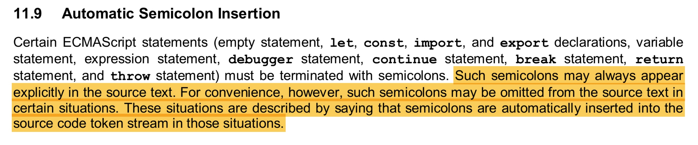

# Foire Aux Questions (FAQ)

Vous trouverez ici toutes les questions les plus posées par les débutants et mes réponses détaillées. N'hésitez pas à me poser vos questions en me contactant via le site de la formation [JavaScript de Zéro](https://www.javascriptdezero.com).

## Questions

1. [Qu'est-ce que la spécification ECMAScript ?](#quest-ce-que-la-spécification-ecmascript-)
2. [D'où vient le JavaScript ?](#doù-vient-le-langage-javascript-)
3. [Est-ce qu'il faut mettre un point-virgule à la fin d'une instruction ?](#est-ce-quil-faut-mettre-un-point-virgule-à-la-fin-dune-instruction-)

## Réponses

### Qu'est-ce que la spécification ECMAScript ?

La spécification ECMAScript est le nom de la norme internationale définissant les règles et les fonctionnalités que doit implémenter un langage de programmation pour être compatible avec elle.

JavaScript fait partie des langages de programmation respectant cette norme. Pour être précis, il respecte la norme [ECMA-262](http://www.ecma-international.org/ecma-262/).

Presque chaque année, une nouvelle version de la norme sort avec son lot de nouveautés et de corrections. À l'heure actuelle, nous sommes à la version 8 du standard ECMAScript, en abrégé, on dit version ES8. Cette version est sortie en Juin 2018.

Dans la formation [JavaScript de Zéro](https://www.javascriptdezero.com), j'enseigne la version 6 de la norme (ES6) car c'est la plus grosse mise à jour du langage depuis des années.

Par ailleurs toutes les nouveautés récentes apportées dans les versions ES7 et ES8 ne sont pas encore gérées par tous les outils utilisant du JavaScript. En revanche pour la version ES6 ça l'est quasiment partout.

### D'où vient le langage JavaScript ?

Le premier prototype de JavaScript a été créé en 1995 par Brendan Eich (en seulement 10 jours !) pour le navigateur Web Netscape Navigator.

Fin 1996, Netscape a soumis JavaScript à l'organisme ECMA International pour standardiser le langage.

Standardiser un langage permet de forcer tous les acteurs souhaitant utiliser ce langage à respecter une seule source d'information : la norme du langage (aussi appelée spécification).

Grâce à cette centralisation, les développeurs peuvent utiliser le langage JavaScript de la même façon partout où il a été intégré.

Ainsi, on peut utiliser JavaScript dans tous les navigateurs en étant sûr qu'il fonctionnera de la même façon. Celà permet d'avoir du code dit _portable_ d'un navigateur à l'autre. 

C'est-à-dire qu'exécuter le même code JavaScript dans tous les navigateurs produira le même résultat.

C'est un atout majeur pour nous, développeurs, car ça nous permet de n'avoir à gérer qu'une seule base de code source pour cibler n'importe quel navigateur !

### Est-ce qu'il faut mettre un point-virgule à la fin d'une instruction ?

_Note: au pluriel, on écrit [points-virgules](https://www.larousse.fr/dictionnaires/francais/point-virgule_points-virgules/62044/difficulte)._

> J'ai rédigé un guide complet sur les points-virgules en JavaScript sur mon blog. Je vous invite à le lire : [Les points-virgules en JavaScript : le guide définitif](https://jeremymouzin.com/blog/les-points-virgules-en-javascript-le-guide-definitif/).

Réponse courte : en théorie oui, c'est la façon classique d'indiquer la fin d'une instruction comme le précise la spécification ECMAScript.

Mais il existe un système nommé **ASI** (**A**utomatic **S**emicolon **I**nsertion) défini dans la spécification qui permet d'insérer automatiquement les points-virgules à certains endroits par commodité.

Extrait de la spec ES6 sur l'ASI:

Mon conseil pour les débutants : apprenez à mettre les points-virgules dans vos programmes. Si votre objectif est de vous faire embaucher, ce sera plus facile pour vous !

En effet, si vous savez déjà mettre les points-virgules et que l'entreprise où vous souhaitez travailler les utilise, vous êtes en bonne position.

Si elle ne les utilise pas, il vous suffira de ne pas les mettre, tout simplement. Ce sera toujours plus facile d'apprendre à les mettre et de ne pas les mettre, que d'apprendre sans les mettre et de devoir apprendre à les mettre ensuite !